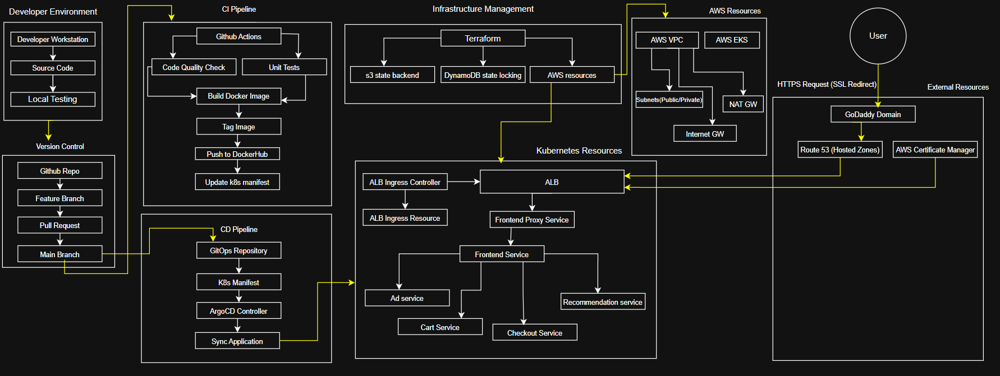

# Overview
This repository contains a comprehensive, production-grade DevOps implementation for an OpenTelemetry-based e-commerce microservices application. The project demonstrates modern cloud-native practices including containerization, infrastructure as code, CI/CD automation, Kubernetes orchestration, and secure application deployment on AWS.

# Architecture diagram


# Key Features

- Microservices Architecture: Containerized e-commerce application with multiple independent services
- Infrastructure as Code: Complete AWS infrastructure provisioning with Terraform
- Kubernetes Deployment: EKS cluster with properly configured resources for all microservices
- CI/CD Pipeline: Automated workflows using GitHub Actions and ArgoCD
- Security Focused: SSL/TLS encryption, private subnets, and secure routing
- Scalable Design: Built to handle growth with proper load balancing and auto-scaling

# Technologies Used

## Infrastructure & Cloud
- AWS Services: EKS, VPC, Route53, ACM, ALB, S3, DynamoDB
- Terraform: Infrastructure as code with remote state management
- Kubernetes: Container orchestration
- Docker: Application containerization

## CI/CD & DevOps
- GitHub Actions: Continuous Integration
- ArgoCD: Continuous Deployment with GitOps
- Docker Hub: Container registry

## Application
- Microservices: Modern application architecture pattern

## Networking & Security
- HTTPS/SSL: Secure communication with ACM certificate
- Custom Domain: Configured with GoDaddy and Route53
- ALB Ingress Controller: Traffic management

# Getting Started

## Prerequisites
- AWS CLI configured with appropriate permissions
- Terraform installed
- kubectl installed and configured
- Docker installed
- GitHub account
- eksctl

## Deploying the Infrastructure

1. Clone the Repository
```
git clone https://github.com/yash-s-patil/ecommerce-devops-project.git
cd ecommerce-devops-project
```

2. Initialize and Apply Terraform Remote backend configuration
```
cd eks/backend
terraform init
terraform plan
terraform apply
```

3. Initialize and Apply Terraform main.tf
```
cd ..
terraform init
terraform plan
terraform apply
```

4. Configure kubectl for EKS
```
aws eks update-kubeconfig --name <cluster-name> --region <aws-region>
```

5. Setup and Deploy ALB Ingress Controller
   
6. Deploy Kubernetes Resources
```
kubectl apply -f kubernetes/serviceaccount.yaml
kubectl apply -f kubernetes/complete-deploy.yaml
```

7. Configure Domain, Route 53 Hosted Zone and AWS Certificate Manager

## Setting up ArgoCD

1. Install ArgoCD
```
kubectl create namespace argocd
kubectl apply -n argocd -f https://raw.githubusercontent.com/argoproj/argo-cd/stable/manifests/install.yaml
```

2. Access ArgoCD UI using
```
kubectl port-forward svc/argocd-server -n argocd 8080:443
```

3. Fetch the password from Secret (Username: admin)
```
kubectl get secret argocd-initial-admin-secret -o jsonpath="{.data.password}" | base64 -d
```

4. Add your repository in ArgoCD UI and Configure Application to track kubernetes/ directory

# Security Considerations
This project implements several security best practices:
- EKS cluster deployed in private subnets
- SSL/TLS encryption for all external traffic
- Network isolation using VPC and appropriate subnet design
- Secure state management with S3 and DynamoDB
- HTTPS redirection from HTTP


